## Disclaimer
Em 2023 logo após a posse do então presidente do Brasil Luis Inácio Lula da Silva, sua esposa e primeira dama sofreu um ato de vandalismo cibernético. Naquela época como estudante e levando em conta a repercusão do caso realizei uma análise sobre as diversas possibilidades em que até mesmo pessoas cercadas por seguranças de todos os segmentos podem ser vítimas de engenharia social. O estudo posteriormente me rendeu boas experiências e muitos primeiros acessos em simulações de Red Team. Este repositório será mantido para fins educacionais e periódicamente (por largos intervalos e na medida do possível) será atualizado com novas técnicas. Divirta-se. 

# Ninguém tá puro: como a primeira-dama pode ter perdido suas credenciais de acesso na plataforma “X”

Sempre que perfis nas redes sociais de pessoas públicas são invadidos, observamos todas as atenções do debate acerca da segurança da informação voltado para o evento em questão. Com o recente ataque à primeira-dama Janja o assunto volta aos holofotes. Muitas das questões, como a motivação e finalidade da ação já estão implicitamente respondidas nas declarações e tomadas de decisões dos atacantes, mas um assunto pouco abordado pela mídia tradicional é como isso pode ter acontecido.

O seguinte artigo busca discorrer sobre três técnicas utilizadas para a violação de credenciais, tendo como vetor de exploração o usuário. Como não se tem conhecimento de nenhuma vulnerabilidade na gestão de acessos, ou vazamentos de credenciais da plataforma em questão, este dificilmente seria um caminho traçado pelos agentes de ameaça. Vale lembrar que os métodos analisados aqui podem não corresponder com o fato registrado. Existem diversas formas de execução de ataque desta natureza e sua implementação depende do conhecimento técnico e criativo do atacante.

Dito isso, é importante ressaltar a necessidade de entender como o roubo de credenciais acontece por meio de OSINT (Open Source Intelligence), Engenharia Social ou uso de ferramentas técnicas. O entendimento de um vetor de ataque pode elucidar o modus operandi de um indivíduo malicioso e desta forma ajudar na conscientização e evitar que outras pessoas sejam vítimas.

## Credenciais vazadas + Mal gerenciamento de Senhas

O vazamento de credenciais pode acontecer por meio da violação do banco de dados de plataformas, ou acesso indevido por agentes de ameaça internos. Dificilmente o indivíduo que obteve as credenciais será o atacante. Na maioria das vezes esse acesso é comercializado em fóruns na deep e dark web de forma impessoal. Isso possibilita que terceiros mal-intencionados adquiram essas credenciais e realizem ataques direcionados com pouquíssimo ou nenhum conhecimento técnico.


No caso em questão não se tem notícias de vazamentos de credenciais na rede social “X”, portanto o perfil do usuário está seguro, certo? Errado! A história muda quando a vítima não pratica um bom gerenciamento de suas senhas. Isso é, definir um padrão de senha forte e único para cada conta nos diferentes serviços utilizados.

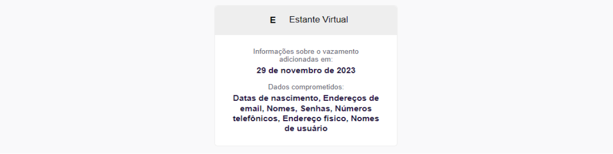

Recentemente o “Firefox Monitor” registrou um vazamento no site de venda de livros "Estante Virtual". Segundo a plataforma de monitoramento, os invasores tiveram acesso a data de nascimento, endereço de e-mail, nomes, senhas, números telefônicos, endereço físico e nomes de usuário. Vamos supor que a primeira-dama então tenha uma conta neste domínio e que sua senha seja a mesma utilizada para acessar sua conta no “X”. Sem muito esforço o indivíduo que adquiriu o banco de dados conseguiria violar o acesso.

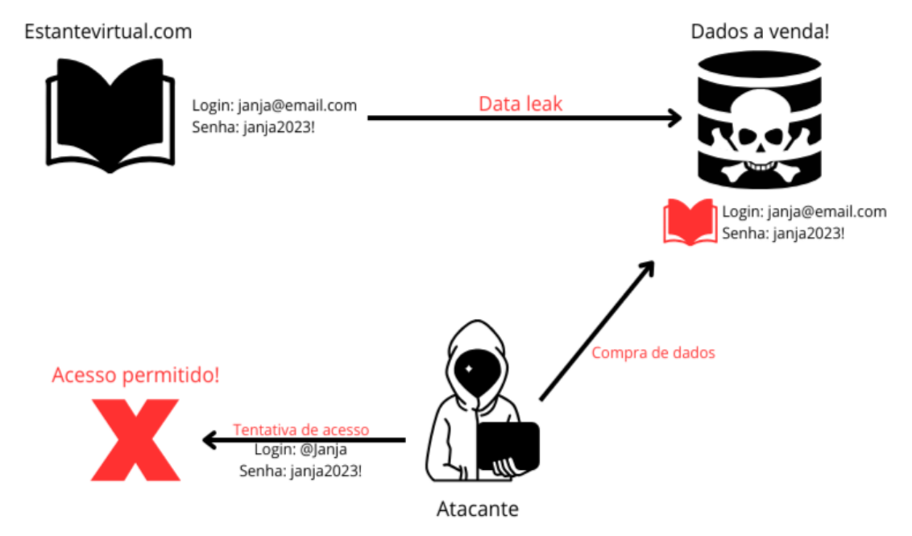

Em outro cenário com o mesmo contexto, as credenciais poderiam ser diferentes, mas seguir o mesmo padrão de senha fraca ou parecida. Com a informação de uma credencial antiga, o atacante pode então gerar uma lista personalizada e basear suas tentativas de login usando o mesmo padrão da credencial obtida.

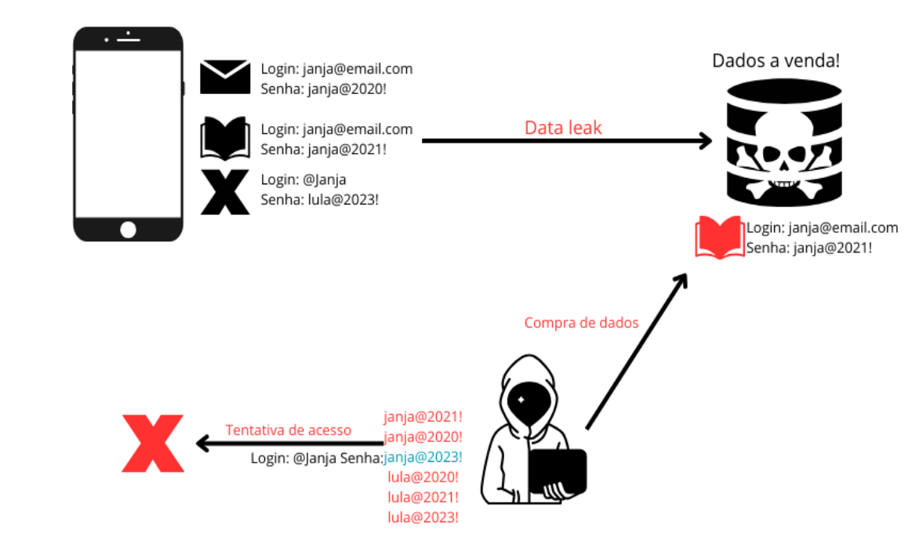

É vero que o ‘X’ bloqueia a tentativa de acesso após seis requisições com senhas incorretas, mas no caso em questão ao usar nomes, datas e caracteres especiais de forma padronizada, a vítima reduz muito as probabilidades de combinações, aumentando desta forma a possibilidade de êxito do atacante.
 
## Phishing
O envio de e-mails falsos usados para atrair a interação do usuário talvez seja uma das formas de ataques mais banais no meio da segurança da informação. No entanto, quanto mais se fala sobre o assunto, mais relatos de vítimas são registrados. Com técnicas de OSINT, preparação de infraestrutura e poucas linhas de comandos em algumas ferramentas automatizadas é possível deixar o e-mail cada vez mais convincente.
 
Para o roubo de credenciais em questão, a ideia é direcionar a vítima para uma página de login falsa e fazer ela inserir ali sua senha. Obviamente o usuário não entrará em seu perfil na plataforma, mas enviará as informações de login e senha para o atacante, que pode usá-las para violar o acesso do perfil e até mesmo sequestrar a conta do alvo. 

O fato da massiva utilização de phishing pode estar ligado com a simplicidade assustadora da preparação de infraestrutura de ataque, somada à elevada chance de êxito. É possível simular este vetor utilizando apenas a ferramenta de código aberto Zphisher e a criação de um e-mail. Com uma distribuição de sistema Unix, é preciso importar a ferramenta. Em seguida, na pasta do repositório baixado se executa o shell script. 

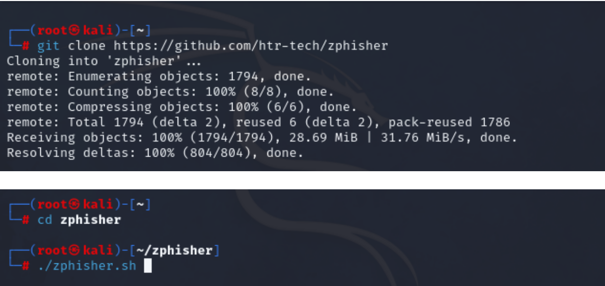

Ao rodar a ferramenta, recebemos um menu intuitivo onde o atacante pode escolher qual plataforma será utilizada. Por padrão o Zphisher não possui o ambiente de login da plataforma X, mas isso pode ser facilmente contornado com ferramentas que não serão abordadas neste artigo. Tendo em vista que a clonagem de código fonte pode violar os termos de serviço da plataforma, nos contentaremos a utilizar o layout antigo do twitter disponibilizado pelo Zphisher.

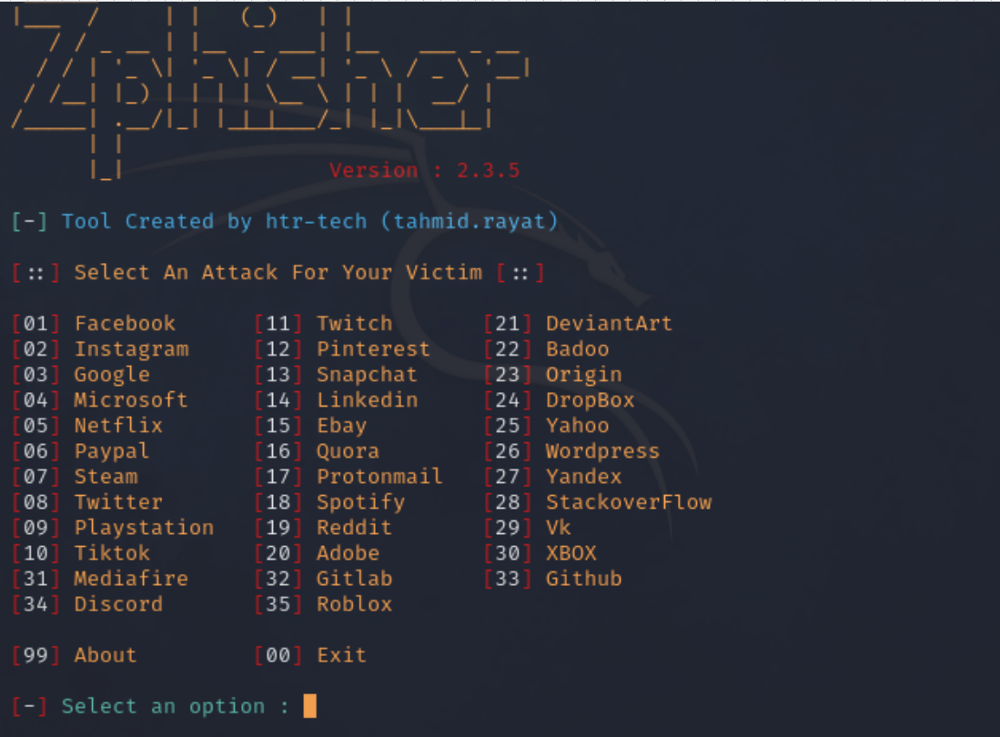

Após escolher a plataforma alvo na qual se pretende obter as credenciais do usuário, o Zphisher oferece a opção de escolher onde o site falso será hospedado.  Na primeira opção a página será criada de forma local, tendo alcance somente no perímetro do host. Na segunda se utiliza o serviço cloudflare para a hospedagem. Já na terceira podemos expor o serviço para o mundo. Isso pode ser feito somente através da obtenção de um IP público ou através do protocolo ivp6. Nas duas últimas opções a página se torna acessível para qualquer dispositivo conectado à internet. Sendo a última utilizada para ataques mais elaborados, vamos utilizar a opção 2 para subir o serviço através da cloudflare.

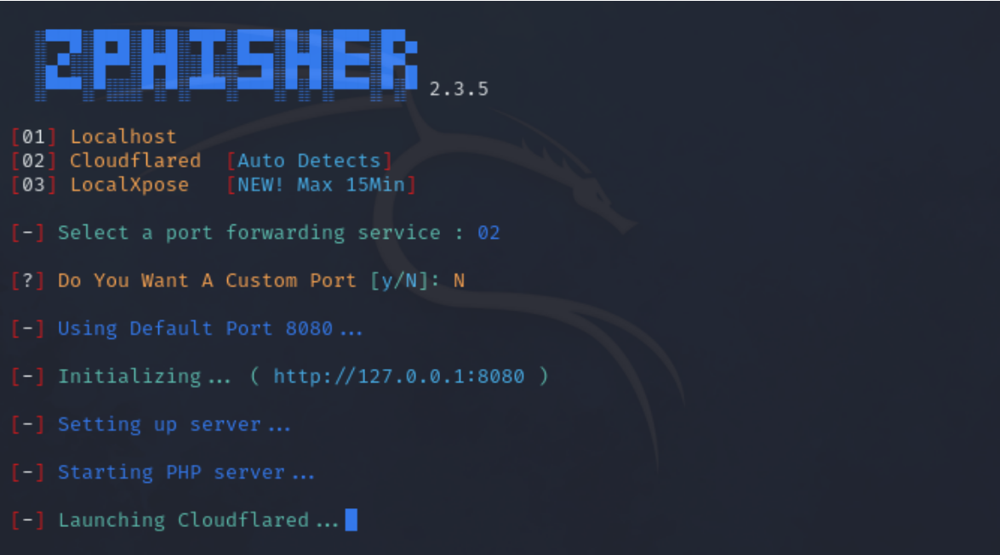

Após a escolha do serviço de hospedagem, o script pergunta se queremos utilizar uma porta específica. Caso a resposta seja negativa ele usará a porta 8080 por padrão. Em seguida é possível personalizar uma URL. Com estes comandos nossa página de login está pronta para ser enviada ao alvo. Enquanto isso, na máquina do atacante, todas as tentativas de entradas serão impressas na tela do atacante.

Com a infraestrutura pronta, basta apenas convencer o alvo de clicar no link e tentar realizar o login. Para isso se cria uma conta de e-mail, que também pode ser personalizada. A verificação do remetente é um dos principais focos de análise para saber se o e-mail é malicioso. No entanto, uma ação mais sofisticada pode criar um domínio com nome parecido a fim de confundir o alvo em questão. Além disso, com a intenção de oferecer uma interface mais amigável, aplicativos de e-mail para smartphones omitem essas informações. 


A engenharia social é a cereja do bolo deste tipo de ataque, afinal não adianta criar uma superfície elaborada caso não consiga convencer o usuário a clicar no link e inserir ali suas credenciais. Por isso, nesta fase se trabalha com questões emocionais do alvo, gerando uma certa urgência e curiosidade em ter acesso à informação. O teor da mensagem vai depender do alvo, seja ele somente uma pessoa ou um grupo de funcionários, podendo aguçar a curiosidade da vítima por meio de assuntos pessoais, profissionais e até políticos. 

Caso o atacante tenha êxito no envio de e-mails, o usuário alvo irá se deparar com uma página de login criada pela ferramenta hospedada pela cloudflare. Levando em conta a necessidade de verificar a informação recebida via e-mail em sua rede social, a vítima pode inserir seu login e sua senha no formulário falso sem pensar duas vezes. Mais uma vez, observamos que a URL no exemplo em questão possuí uma diferença gritante, mas com acesso por um navegador de smartphone isso se torna um pouco mais difícil de ser identificado por um usuário leigo. 

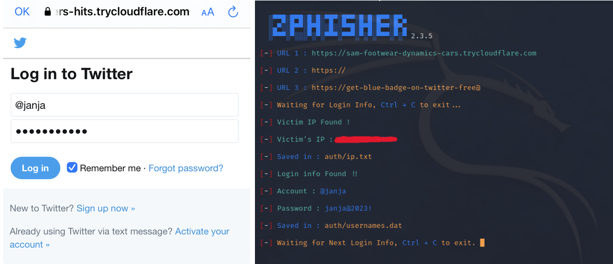

Ao receber as credenciais inseridas na página falsa, o Zphisher retorna instantaneamente o nome do usuário, a senha e o IP do alvo. Vale ressaltar que no exemplo citado, algumas ambiguidades como o uso do nome X e twitter poderiam facilmente levantar suspeita da vítima e fazer com que o ataque seja malsucedido. Além disso, o link utilizado da cloudflare pode ser detectado pelo navegador do usuário e instantaneamente bloqueado. No entanto, como já citado acima, uma superfície de ataque um pouco mais elaborada poderia contornar estas adversidades.

## Man in the middle + DNS Spoofing

A instalação do atacante entre a conexão da vítima com a internet, com a captura da tabela de roteamento exige um pouco mais de elaboração. Mesmo que navegadores tenham combatido ativamente este tipo de ataque com verificação de certificado confiável e protocolo HSTS, ainda é possível capturar o tráfego e convencer o alvo a enviar formulários se explorarmos a falta de conhecimento do usuário. 

Seguindo o exemplo do caso em questão, vamos supor que a primeira-dama tenha costume de frequentar um café periodicamente e ali usa a internet local para ler notícias, acessar e-mails e atualizar suas redes sociais. Para realizar o ataque, o agente de ameaça deve se instalar na mesma rede da vítima e sabendo deste costume pode definir desta forma a hora e local como ponto de ataque.

Existem diversas formas de conduzir um ataque de MITM (Man in the Middle) e o mesmo pode ser utilizado para inúmeras finalidades. Para capturar as credenciais do alvo nesta situação hipotética é necessário subir um servidor http com suporte ssl e um certificado autoassinado. Isso fará o spoofing evitar o redirecionamento da requisição para o protocolo SSL do site original.

```
mkdir /var/www/redestarbucks.com

nano /etc/apache2/sites-available/redestarbucks.com.conf
 
<VirtualHost *:80>
    	ServerName www.redestarbucks.com
DocumentRoot /var/www/redestarbucks.com
    	<Directory /var/www/redestarbucks.com>
        	Options Indexes FollowSymLinks
        	AllowOverride None
        	Require all granted
    	</Directory>
</VirtualHost>

 
openssl req -x509 -nodes -days 365 -newkey rsa:2048 -keyout /etc/ssl/private/www.redestarbucks.com.key -out /etc/ssl/certs/www.redestarbucks.com.crt
 
nano /etc/apache2/sites-available/rede-ssl.conf
 
<VirtualHost *:443>
    	ServerName www.redestarbucks.com.com
    	DocumentRoot /var/www/redestarbucks.com
    	SSLEngine on
    	SSLCertificateFile /etc/ssl/certs/www.redestarbucks.com.crt
    	SSLCertificateKeyFile /etc/ssl/private/www.redestarbucks.com.key
</VirtualHost>
 
cd /etc/apache2/sites-available/
sudo a2ensite rede-ssl.conf
a2ensite redestarbucks.com.conf
sudo a2dissite default-ssl.conf
a2enmod proxy
a2enmod proxy_http
sudo a2enmod ssl
sudo systemctl restart apache2

```

Navegadores modernos costumam realizar o redirecionamento automático para os certificados de segurança dos sites e o cenário piora quando o domínio está em cache ou está registrado no protocolo HSTS do serviço. Neste contexto, antes de realizar a conexão com o domínio falso, o navegador consulta primeiro sua base de dados em busca de confiabilidade, se não corresponderem o acesso ao domínio fica suspenso.

Para contornar estas adversidades deve-se propor então um cenário alternativo, onde se simula a necessidade de um login para continuar navegando. Após subir o servidor se implementa uma página para confundir o usuário. Para isto utilizaremos o template já disponível nos diretórios do Zphisher. Isso pode ser feito com os seguintes comandos.
```
git clone --depth=1 https://github.com/htr-tech/zphisher.git
cp zphisher/.sites/google/* /var/www/redestarbucks.com
chown -R www-data:www-data /var/www/redestarbucks.com
chmod -R 755 /var/www/redestarbucks.com
```

Nestes passos baixamos do repositório o Zphisher, copiamos os templates para o diretório do site levantados e concedemos permissão ao www.data para criar arquivos na pasta. Ao receber as credenciais, a página .php utilizada cria um arquivo de texto onde podem ser verificadas as credenciais obtidas. Para validar sua validade, podemos acessar a página na máquina local.

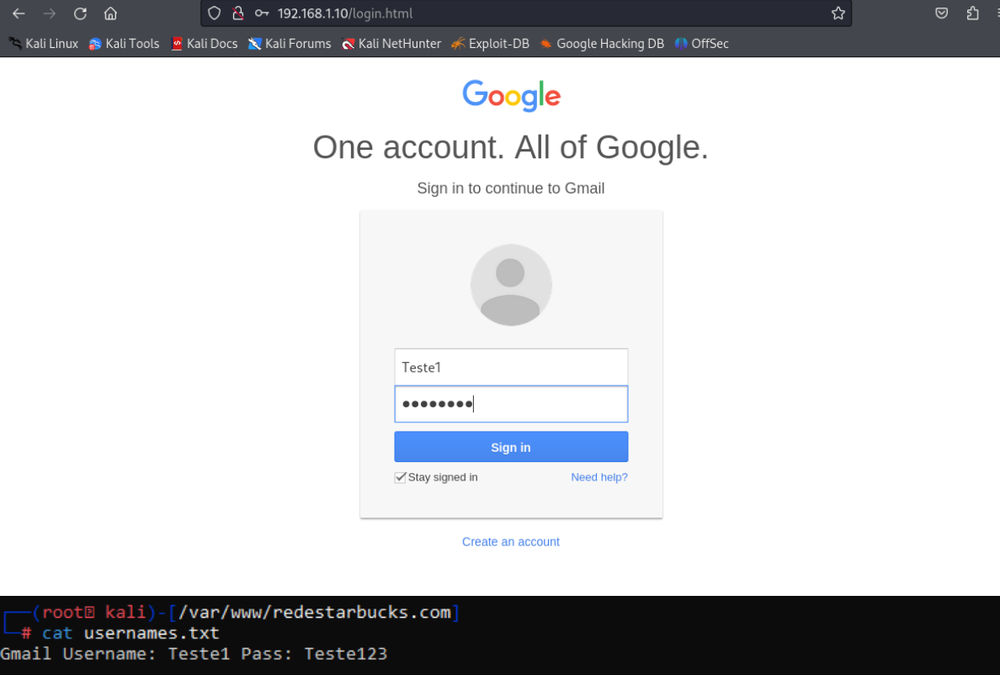

Com o serviço falso funcionando, o atacante se coloca entre as conexões do alvo e o gateway fornecido pelo roteador. Desta forma todo tráfego passará pela máquina do autor permitindo a verificação das requisições realizadas pela vítima. Para isso deve-se habilitar o encaminhamento de tráfego e iniciar a ferramenta arpspoof nos dois sentidos.

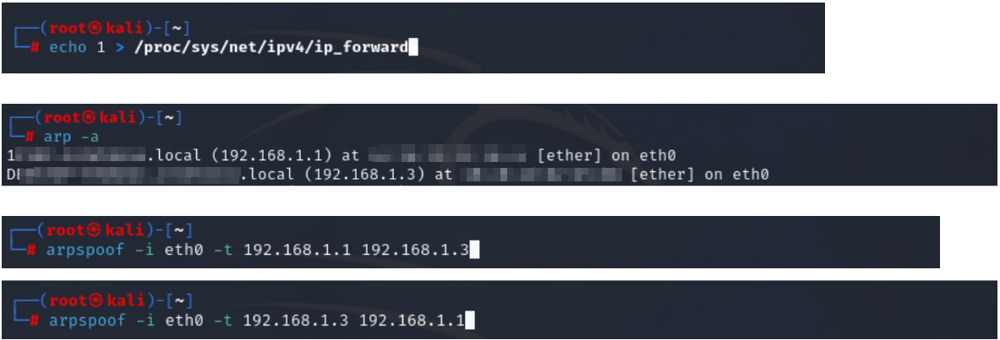

Tendo a informação sobre o tráfego da vítima, o atacante pode começar a observar quais sites utilizados na seção fazem requisição http primeiro. Através da ferramenta Wireshark é possível ter acesso aos pacotes interceptados de forma interpretada. Após definir a interface que está realizando a captura é possível aplicar o filtro de exibição somente das requisições HTTP.

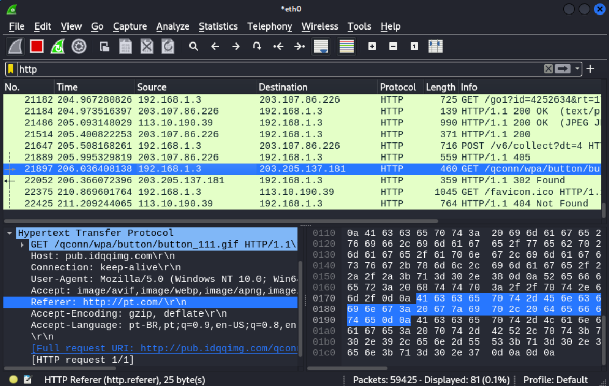

Isso mostra que muitas requisições são enviadas primeiro ao serviço HTTP para depois ser redirecionada. Caso queira sofisticar ainda mais o ataque, o indivíduo pode criar um Spoofing do DNS de forma personalizada, evitando fazer muito barulho na rede. Mitigar comportamentos estranhos, seguindo a rotina de acesso da vítima pode aumentar de forma substancialmente a possibilidade de sucesso do ataque.

Para direcionar o acesso do alvo à página maliciosa construída nos passos anteriores pode ser empregada a ferramenta de código aberto Ettercap. Esta irá tomar controle da tabela DNS e indicará a máquina da vítima qual ip deverá requisitar para a URL informada. Neste caso, o ip relacionado ao serviço web criado. 

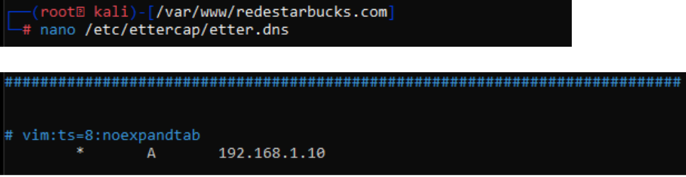

No exemplo implementado orientamos no arquivo de configuração etter.dns, a indicação de que toda requisição realizada deverá ser direcionada para nosso domínio. Isso gerará uma indisponibilidade na rede da vítima e simulará a necessidade de realizar o login para continuar navegando. Mais uma vez é preciso salientar que personalizando esta tabela de acordo com o tráfego do alvo, a ação se torna muito menos estrondosa. A inclusão dos domínios http capturados no arquivo de DNS do ettercap poderia ser facilmente automatizada por meio de diversas linguagens de programação, mas isso foge do escopo deste artigo.

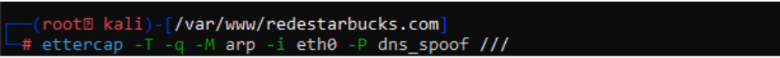

Definindo a resolução dos nomes no DNS e apontando para nossa página de captura, basta rodar o Ettercap. Por meio do comando indicado acima, solicitamos a ferramenta que suba o spoofing com o parâmetro de que toda a rede deverá responder a ele. Somando com o direcionamento e captura do tráfego por meio do arpspoofing, a maioria das requisições do ip apontado anteriormente cairá na nossa página de acesso. Caso o tráfego seja interceptado na requisição http, a vítima verá nossa página sem quebra de confiança. Se a requisição for SSL, o usuário alvo deverá autorizar a conexão insegura (uma ação não muito rara). Já para protocolo HSTS, o tráfego será impedido, induzindo a vítima a verificar sua conexão em outras páginas.

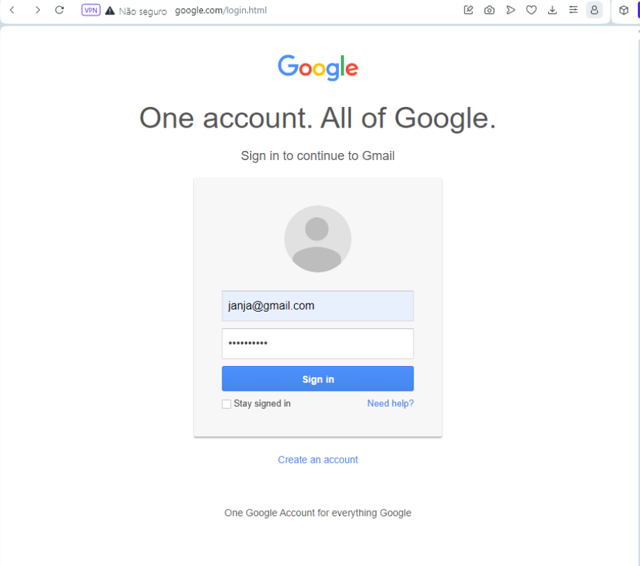

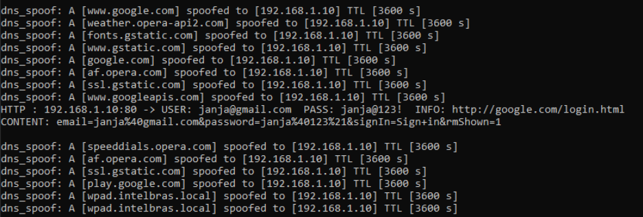

Se a vítima inserir na página suas credenciais, os dados enviados serão exibidos em texto claro para o atacante, além de ficarem armazenados no arquivo criado pelo .php. Esta funcionalidade pode variar de acordo com o navegador e da quantidade de cache armazenado no mesmo. 

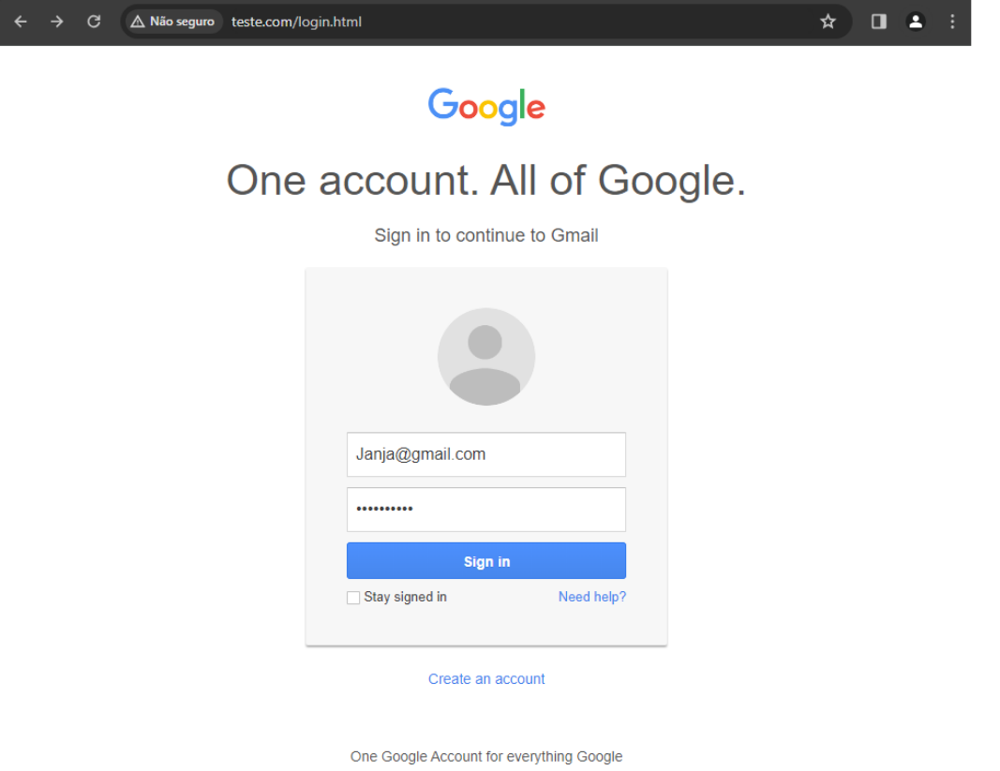

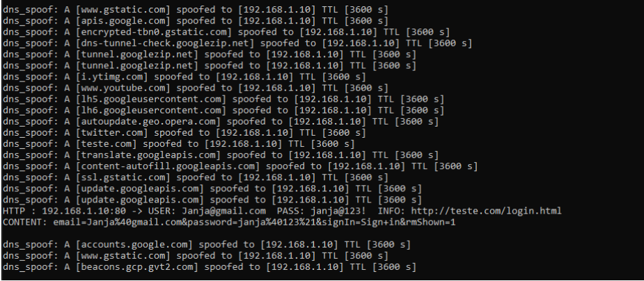

No primeiro exemplo a requisição foi direcionada com facilidade, nosso DNS interceptou a requisição HTTP e retornou a página, antes mesmo do redirecionamento para o https. No segundo exemplo foi necessário que a máquina alvo navegasse um pouco mais até que esbarrasse no serviço falso. Apesar de ser comum, principalmente em redes públicas, a negação de acesso e o direcionamento de páginas podem levantar o alerta do alvo.

# Conclusão
Tendo conhecimento das formas ataques demonstrados acima, se observar que a obtenção de credenciais para acesso indevido não necessita de um conhecimento aprofundado e muito menos de uma infraestrutura elaborada. Além disso, pode-se verificar que apesar dos diversos protocolos de segurança implantados por navegadores, serviços de e-mails e plataformas web, ainda é possível explorar a falta de conhecimento ou a não conscientização sobre segurança, tendo como principal alvo o usuário comum. 

Foram abordados três cenários diferentes que apenas arranham a superfície da gama de formas de ataques e obtenção não autorizada de dados confidenciais. Ainda neste escopo, um atacante mais empenhado ainda poderia fazer uso de trojans,  keyloggers, backdoors de acesso ao dispositivo, sequestro de sessão entre muitos outros. Novas formas de violação surgem todos os dias e o número de vítimas cresce na mesma proporção.
